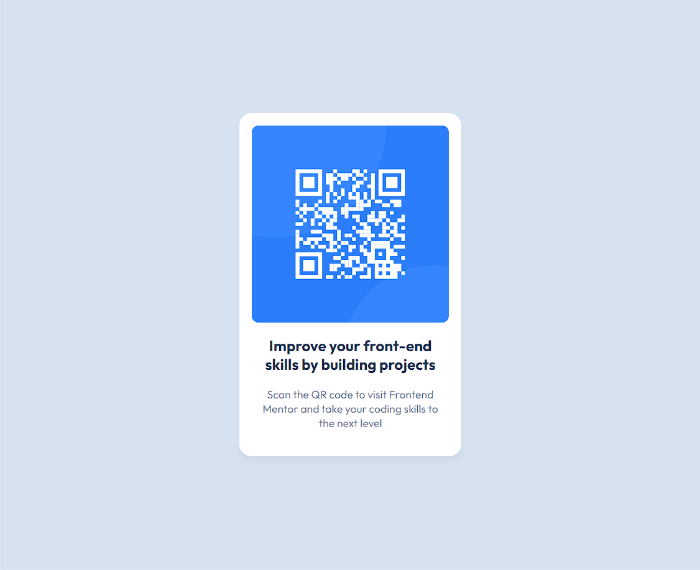

## Table of contents

- [Overview](#overview)
  - [Screenshot](#screenshot)
  - [Links](#links)
- [My process](#my-process)
  - [Built with](#built-with)
- [Author](#author)

**Note: Delete this note and update the table of contents based on what sections you keep.**

## Overview

### Screenshot

#### Mobile View:

#### Desktop View:

### Links

- Live Site URL: [qr-code-component-ffxkg6th6-ilcabezon.vercel.app]

## My process

### Built with

- Semantic HTML5 markup
- CSS custom properties
- Mobile-first workflow

## Author

- Frontend Mentor - [IlCabezon](https://www.frontendmentor.io/profile/IlCabezon)
- Linkedin - [@francastro07](https://www.linkedin.com/in/francastro07/)
